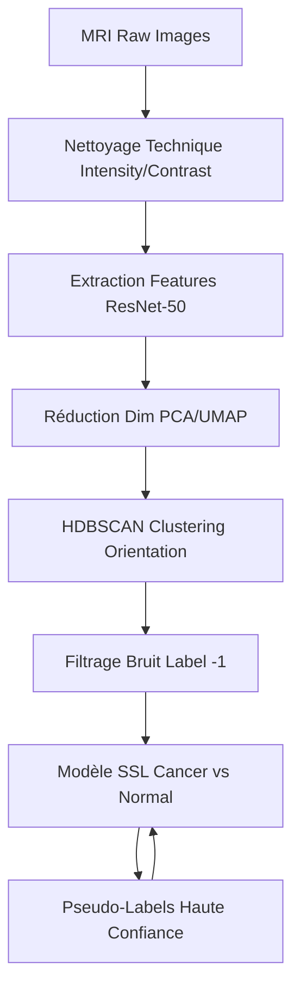
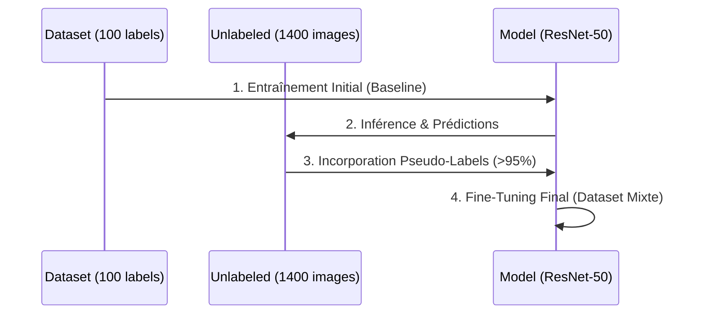

# 🚀 BrainScanAI

[](https://www.python.org/)
[](https://pytorch.org/)
[](https://scikit-learn.org/)
[](https://fastapi.tiangolo.com/)
[](https://github.com/astral-sh/uv)

**BrainScanAI** est une solution experte de détection et classification automatique de pathologies cérébrales (Cancer vs Normal) par IRM. Ce projet implémente une architecture de **Semi-Supervised Learning (SSL)** pour pallier le manque de données médicales expertes.

---

### 🎯 Objectif du projet

L'objectif est de transformer une masse de données brutes (~1400 images inconnues) en un dataset qualifié et un modèle de détection robuste. Le projet repose sur l'extraction d'embeddings profonds (Transfer Learning via ResNet-50) et une stratégie de **Pseudo-Labeling** pour étendre le jeu d'entraînement supervisé initial (100 images).

### ✨ Fonctionnalités

- ✅ **Extraction de Features** : Transformation des images IRM en vecteurs de 2048 dimensions via ResNet-50.
- ✅ **Nettoyage Automatisé** : Suppression des images corrompues par analyse de l'intensité des pixels (`mean` & `std`).
- ✅ **Clustering d'Orientation** : Tri automatique des vues (Axial, Sagittal, Coronal) via PCA-UMAP-HDBSCAN.
- ✅ **Filtrage du Bruit** : Exclusion des images non-anatomiques identifiées comme "bruit" par HDBSCAN.
- ✅ **Semi-Supervised Learning** : Pseudo-Labeling à haute confiance (95%+) pour le fine-tuning du classifieur.

---

### 📊 Diagrammes Architecturaux

#### Architecture de Traitement


#### Flux de Travail (SSL)


---

### 📂 Structure des Fichiers

```text
BrainScanAI/
│
├── 📂 config/               # Configuration et logging centralisé
│   ├── config.py           # Chemins et hyperparamètres
│   └── logger.py           # Gestionnaire de logs
│
├── 📂 mri_dataset_brain_cancer_oc/ # Datasets
│   ├── 📂 avec_labels/      # Ground Truth (Cancer/Normal)
│   ├── 📂 sans_label/       # Pool d'images pour le SSL
│   ├── features.parquet     # Embeddings compressés
│   └── images_orientation.parquet # Mapping orientations calculé
│
├── 📂 notebooks/            # Workflow Pipeline
│   ├── 01_Exploration_labelisés.ipynb    # EDA & Labellisation manuelle
│   ├── 02_Exploration_non_labelisés.ipynb # Analyse du pool brut
│   ├── 03_Traitement_embeddings.ipynb    # Extraction ResNet-50
│   ├── 04_Clustering_images.ipynb        # PCA-UMAP-HDBSCAN Orientation
│   └── 05_Entrainement_semi_supervisé.ipynb # Pipeline SSL & Cleaning final
│
├── pyproject.toml           # Gestion des dépendances (UV)
└── README.md                # Documentation technique
```

---

### 🚀 Installation Rapide

#### Prérequis
- Python 3.11 à 3.13
- Gestionnaire de paquets `uv` (recommandé) ou `pip`

#### Initialisation
1. **Environnement** :
   ```bash
   uv sync
   # ou
   python -m venv .venv
   source .venv/bin/activate # Windows: .venv\Scripts\activate
   pip install -r requirements.txt
   ```

2. **Configuration** :
   Vérifiez le fichier `config/config.py` pour ajuster les chemins vers vos données.

---

### 🧪 Nettoyage & Qualité des Données

Afin de répondre aux exigences de traitement des valeurs aberrantes, le projet intègre :
1. **Filtre d'Intensité** : Suppression des images dont la moyenne des pixels est $\le 10$ (images noires/vides).
2. **Filtre de Contraste** : Écart global sur l'écart-type ($std \in [5, 80]$) pour éliminer les bruits numériques.
3. **Filtre Structurel** : Utilisation d'HDBSCAN pour rejeter les images ne correspondant à aucun cluster anatomique cohérent (label `-1`).

---

### 🧪 Tests & Validation

Les performances sont évaluées via :
- **F1-Score** : Pour équilibrer la précision et le rappel sur les cas pathologiques.
- **Matrice de Confusion** : Pour surveiller spécifiquement les Faux Négatifs (patients cancéreux non détectés).
- **Validation Croisée** : Utilisation exclusive des labels humains "Vérité Terrain" pour les métriques de validation finale, même lors de l'entraînement SSL.

---

### 👤 Auteur
**RandomFab**

### 🙏 Remerciements
Merci aux contributeurs et aux experts pour les datasets initiaux de recherche médicale.

