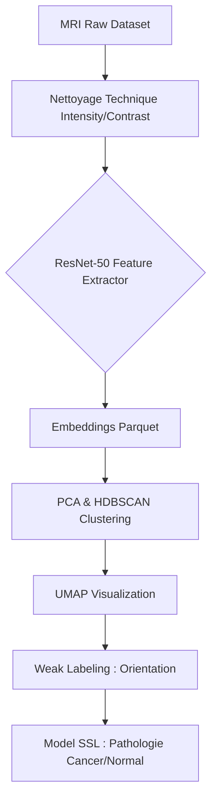
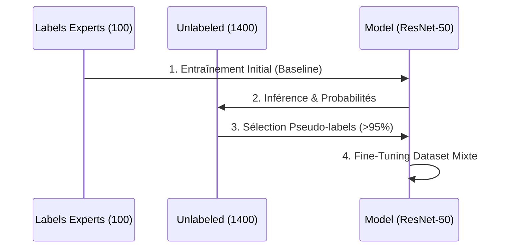

# 🧠 BrainScanAI

[](https://www.python.org/)
[](https://pytorch.org/)
[](https://scikit-learn.org/)
[](https://umap-learn.readthedocs.io/)
[](https://hdbscan.readthedocs.io/)

**BrainScanAI** est une solution de pointe pour la détection et la classification automatique de tumeurs cérébrales à partir d'images IRM. Le projet combine l'extraction de caractéristiques par Deep Learning et des techniques de clustering non supervisé pour organiser et annoter intelligemment les données médicales.

---

### 🎯 Objectif du projet

L'enjeu majeur est d'automatiser le tri des images IRM selon leur orientation (face, côté, haut) et de détecter la présence de tumeurs. En utilisant des embeddings extraits via ResNet et des algorithmes comme HDBSCAN et UMAP, nous parvenons à structurer des datasets non étiquetés pour accélrer le diagnostic médical.

### ✨ Fonctionnalités

- ✅ **Extraction de Features** : Utilisation de modèles pré-entraînés (ResNet/Torchvision) pour transformer les images en vecteurs mathématiques.
- ✅ **Clustering Intelligent** : Identification automatique des orientations d'images avec HDBSCAN.
- ✅ **Visualisation Haute Dimension** : Projection des données dans un espace 2D avec UMAP pour l'analyse visuelle.
- ✅ **Auto-Labellisation (Weak Labeling)** : Propagation automatique des labels d'orientation aux images non étiquetées.

---

### 🧠 Synthèse des résultats & enseignements


#### 📈 Clustering & orientation
Le clustering non supervisé (UMAP + HDBSCAN) sépare parfaitement les 3 orientations (Top, Side, Face). L'orientation est la source de variance **primaire** dans les images IRM.

#### 🩺 Clustering pathologique (Cancer vs Normal)
Le benchmark K-Means (non supervisé) montre des performances faibles pour distinguer Cancer vs Normal, que ce soit en 2D (UMAP) ou en 128D (PCA). Cela prouve que la pathologie n'est pas une caractéristique naturelle évidente des données brutes :
- La structure géométrique globale d'une IRM "Cancer" est trop proche de celle d'un patient "Normal" pour être séparée sans supervision.
- L'approche **Semi-Supervisée (SSL)**, avec pseudo-labeling et validation stricte, est indispensable pour apprendre à ignorer le bruit anatomique et se concentrer sur les marqueurs de tumeur.


#### 🏆 Performances du modèle semi-supervisé (SSL)
Le modèle entraîné en semi-supervisé (ResNet50 + pseudo-labeling) atteint des performances robustes sur la détection Cancer vs Normal.

Les résultats sont visualisés directement dans le notebook `notebooks/Entrainement_semi_supervisé.ipynb` :
- **Courbe F1-score** (moyenne glissante)
- **Courbes de loss** (train/val)
- **Matrice de confusion** (Cancer vs Normal)

👉 **Consultez les graphiques du notebook pour une évaluation complète et à jour des performances.**

#### 🤖 Auto-Encodeurs (AE) : intérêt et limites
Un auto-encodeur pourrait apprendre les caractéristiques spécifiques des IRM, mais il se concentrerait surtout sur la reconstruction de l'anatomie (majoritaire dans les données) et non sur la tumeur (signal faible). Pour évaluer un AE :
- **Erreur de reconstruction (MSE)** : Quantitatif.
- **Inspection visuelle** : Qualitatif.
- **Pertinence de l'espace latent** : UMAP sur le goulot d'étranglement.
Dans ce projet, l'AE standard n'apporte pas de gain par rapport au ResNet pour la séparation pathologique.

#### 🔁 SSL & pseudo-labeling : stratégie
La stratégie de pseudo-labeling par seuils (0.05/0.95) et validation stricte sur labels humains permet d'augmenter le dataset sans fuite de données. Une seconde passe permet de récupérer les images "neutres" (zone d'incertitude) et d'améliorer la couverture du jeu d'entraînement.
---

### 🧪 Nettoyage & Qualité des Données
Afin de répondre aux exigences de traitement des valeurs aberrantes, le projet intègre :
1. **Filtre d'Intensité** : Suppression des images (pixels mean $\le 10$).
2. **Filtre de Contraste** : Écart global sur l'écart-type ($std \in [5, 80]$).
3. **Filtre Structurel** : Utilisation du label `-1` d'HDBSCAN pour rejeter le bruit anatomique.

---

### 📊 Architecture & flux

#### Flux global de traitement


#### Séquence d'entraînement semi-supervisée (Pseudo-Labeling)


---

### 📂 Structure des Fichiers

```text
BrainScanAI/
├── 📂 config/               # Configuration globale et logging
│   ├── config.py
│   └── logger.py
├── 📂 mri_dataset_brain_cancer_oc/ # Données IRM
│   ├── 📂 avec_labels/      # Images étiquetées (Cancer/Normal)
│   ├── 📂 sans_label/       # Images brutes pour le SSL
│   ├── features.parquet     # Embeddings calculés
│   └── images_orientation.parquet # Mapping orientations calculé
├── 📂 notebooks/            # Workflow Pipeline
│   ├── 01_Exploration_labelisés.ipynb
│   ├── 02_Exploration_non_labelisés.ipynb
│   ├── 03_Traitement_embeddings.ipynb
│   ├── 04_Clustering_images.ipynb
│   └── 05_Entrainement_semi_supervisé.ipynb
├── pyproject.toml           # Dépendances (UV)
└── README.md
```

---

### 🚀 Installation Rapide

#### Prérequis
- Python 3.11 à 3.13
- CUDA 12.8 (optionnel pour l'accélération GPU)

#### Installation
1. Cloner le dépôt :
   ```bash
   git clone https://github.com/votre-repo/BrainScanAI.git
   cd BrainScanAI
   ```
2. Installer les dépendances avec `uv` :
   ```bash
   uv sync
   ```

---

### 🧪 Utilisation

Pour lancer l'analyse de clustering et l'auto-labellisation :
1. Ouvrez le notebook `notebooks/Clustering_images.ipynb`.
2. Exécutez les cellules pour :
   - Charger les embeddings.
   - Entraîner le clusterer HDBSCAN.
   - Visualiser les groupes via UMAP.
   - Générer le `weak_orientation` mapping.

---

### 👤 Auteur
**RandomFab** 

### 🙏 Remerciements

